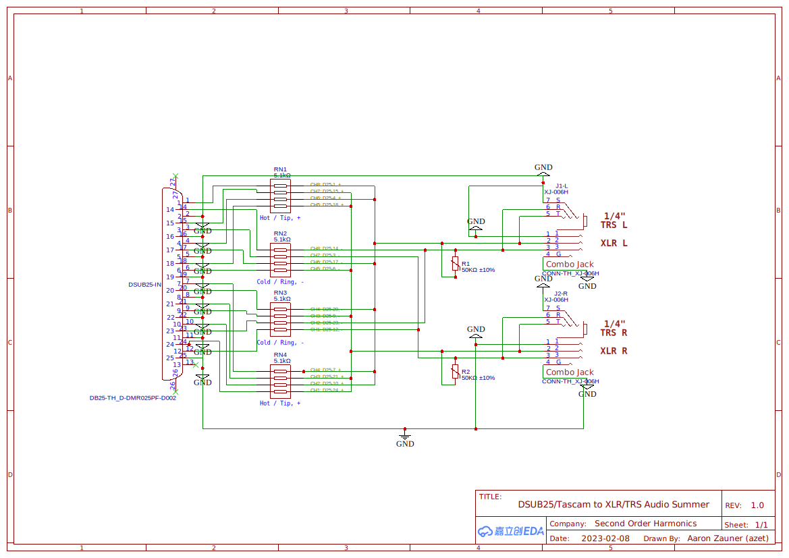

# Audio Summer: DSUB25/Tascam to XLR/TRS combo Jack

 

## Author and license

	Version:  1.0B
	Author:   Aaron <azet> Zauner
	License:  CC0 1.0 Universal - Public Domain Dedication

## Details

A very basic passive audio summer. It sums Tascam/DSUB25 Input (8x XLR or TRS jacks to DSUB/TASCAM) to two combo XLR/TRS Jacks fully balanced. 
So you may only connect one stereo TRS of them for the sum with a symmetric cable or two TS. You may even connect two balanced/TRS/XLR to get two summing busses.

Consider [buying one for cheap off of Reverb](https://reverb.com/item/66385479-second-order-harmonics-dsub25-tascam-to-xlr-trs-audio-summer-2023-black) if you don't want to fabricate yourself.

## Final product

 

## Schematic

## 3D

## Feedback & Contact
Please get in contact for any questions at azet (at) azet.org.
